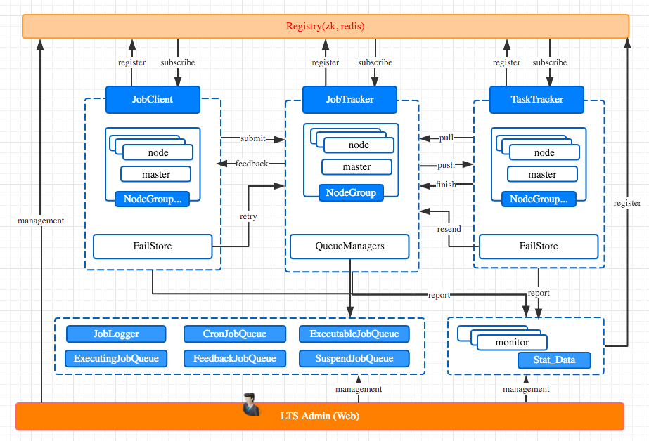
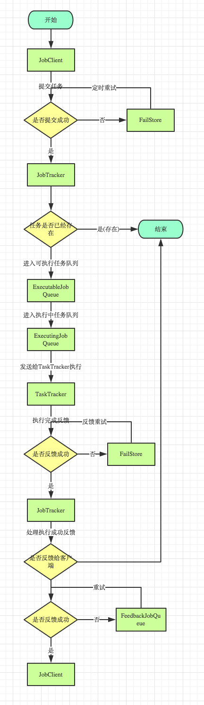
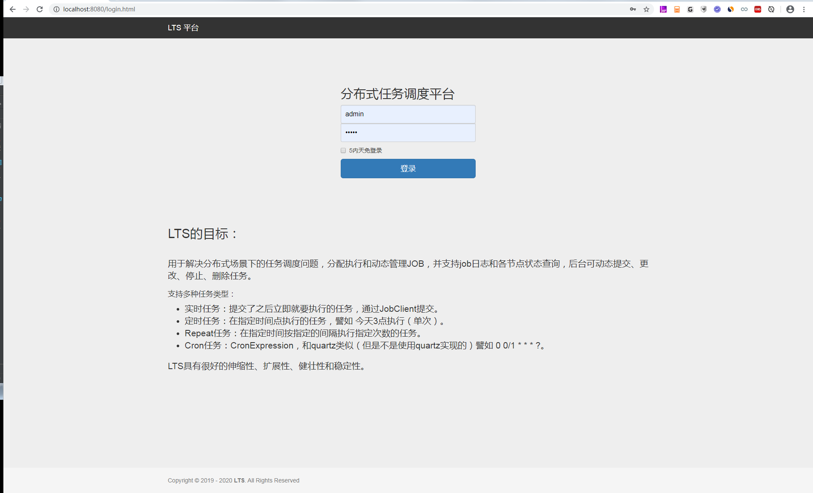
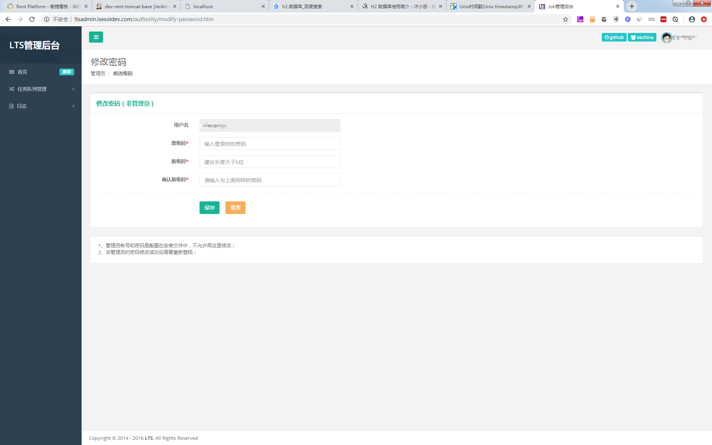
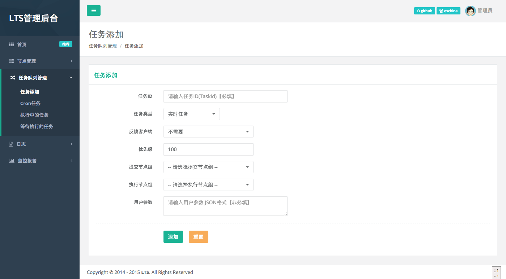
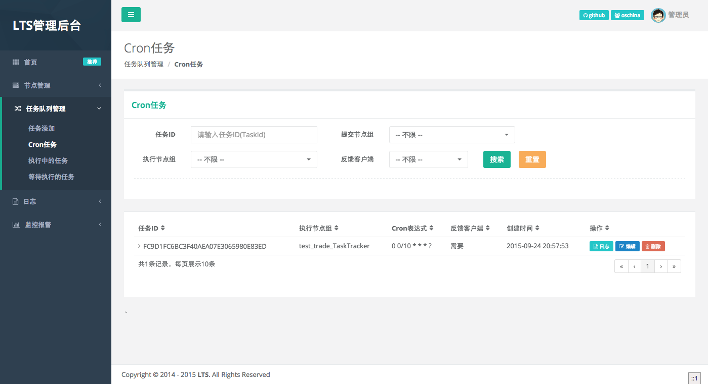
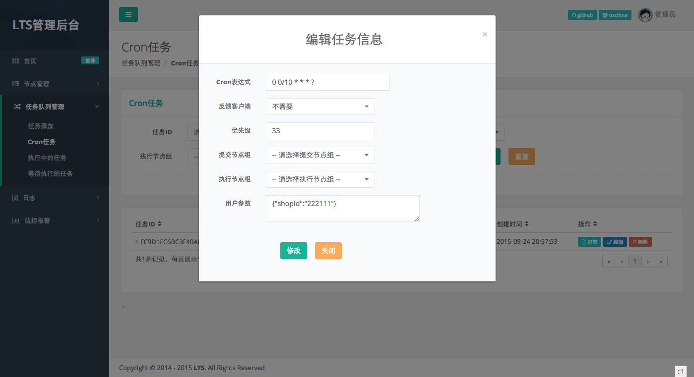
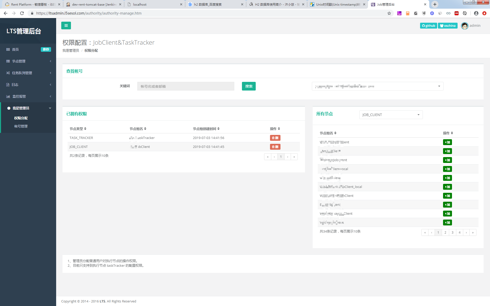
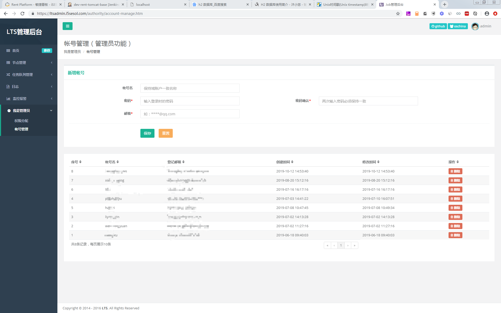

# LTS-JOB

轻量级分布式任务调度系统（light-task-scheduler-system），支持实时任务、定时任务、Cron 与 Repeat 等，具备伸缩性、扩展性与 FailStore 容错；可选 Spring / Spring Boot 集成。

> 欢迎更多人参与维护与交流。QQ 群 **806620585**。版本规划与变更记录见 [docs/dev-plan.md](./docs/开发计划.md)。

## 目录

| 章节 | 说明 |
|------|------|
| [1. 项目说明](#1-项目说明) | 能力、节点与任务类型、架构与概念、流程、机制与特性 |
| [2. 部署、安装与维护](#2-部署安装与维护) | 模块说明、编译打包、运行环境、脚本部署、运维要点 |
| [3. 在业务代码中集成使用](#3-在业务代码中集成使用) | Maven、JobClient / TaskTracker / JobTracker、Spring / Boot、参数、进阶与 SPI |
| [4. LTS-Admin 管理后台](#4-lts-admin-管理后台) | 访问方式、功能与路由、`docs/LTS-Admin` 配图、与 Monitor 的关系 |
| [附录](#附录) | 多网卡、`identity`、外链与 `docs/` 备查 |

---

## 1. 项目说明

### 1.1 定位与主要能力

1. 支持分布式，解决多点故障，支持动态扩容、容错与重试。
2. Spring / Spring Boot 支持；可与 Spring Quartz Cron 配合接入。
3. 节点与任务执行监控、JVM 监控（配合 Monitor 与 Admin）。
4. 管理后台支持动态提交、修改、停止任务等运维能力。

### 1.2 节点角色、通信与任务类型

LTS 主要有以下 **五种节点角色**（其中 JobClient、JobTracker、TaskTracker 为 **无状态**，可多实例部署以实现负载均衡；框架采用 **FailStore** 做远程不可用时的本地补偿）。

| 角色 | 职责 |
|------|------|
| **JobClient** | 提交任务，接收任务执行反馈（若配置了需反馈）。 |
| **JobTracker** | 接收并分配任务，负责任务调度与队列。 |
| **TaskTracker** | 执行任务，将结果反馈给 JobTracker。 |
| **LTS-Monitor** | 收集各节点监控信息（任务、JVM 等）。 |
| **LTS-Admin** | Web 管理后台：节点、任务队列、监控、权限等。 |

**注册中心**（Zookeeper 推荐，或 Redis）负责节点信息暴露与 master 选举；**任务队列与执行日志** 可使用 MySQL（推荐）或 MongoDB；**RPC** 可选 Netty 或 Mina；序列化可选 fastjson、hessian2、java 等。

**任务类型**：实时任务；定时任务（指定时刻单次）；Cron 表达式任务（非 Quartz 实现）；Repeat 任务（如每隔固定间隔执行若干次后停止）。

此外支持动态修改任务参数与触发时间、后台动态加任务、Cron 暂停、有条件地停止执行中任务、任务统计与业务日志串联查看等。

### 1.3 架构组成说明



* **Registry**：注册中心（Zookeeper 推荐或 Redis），节点暴露与 master 选举。
* **FailStore**：远程失败时本地落盘再补偿；典型场景与可选实现见 **§1.4**（避免与下文重复展开）。
* **QueueManager**：任务队列（MySQL 推荐或 MongoDB），存任务与执行日志等；亦可 SPI 扩展其它存储（如自建 Oracle 等需自行实现队列接口）。
* **RPC**：LTS 自带 Netty / Mina，可 SPI 替换。
* **NodeGroup（节点组）**：同组节点对等、对外服务等价；每组由框架动态选举 **master**，节点宕机后会重选；框架提供 **master 变更监听** API。
* **ClusterName**：逻辑集群名；`clusterName` 相同的节点才组成同一套 LTS 拓扑（须与配置一致）。

### 1.4 核心概念：节点组与 FailStore

**节点组（NodeGroup）**

1. 一个节点组相当于一个小集群，组内节点对等、提供同类能力。
2. 每个节点组有一个 **master**（框架选举），宕机后自动切换；业务可监听 master 变化做自定义逻辑。
3. **JobClient** 与 **TaskTracker** 都可划分多个节点组（例如 Web 侧一个 Client 组只向交易侧某个 TaskTracker 组投递任务）。
4. **同一 `clusterName` 集群内，所有 JobTracker 进程属于同一个 JobTracker 节点组**（可多机多进程部署以实现高可用）；与可多个的 JobClient / TaskTracker 节点组区分。
5. 多组 JobClient、多组 TaskTracker 与一个 JobTracker 节点组共同构成大集群。

**FailStore**：失败落盘、通信恢复后再提交；用于 JobClient 提交、TaskTracker 结果回传与业务日志上报等路径；实现可选 leveldb、rocksdb、berkeleydb、mapdb、ltsdb 等，可 SPI 自定义。

### 1.5 典型执行流程（文字概要）

1. JobClient 向 JobTracker 提交任务：可使用「失败即返回」客户端，或 **RetryJobClient**（失败先入 FailStore，再异步重试）；FailStore 目录若挂 NFS 可在同节点组多进程间共享（注意并发与锁）。
2. JobTracker 将任务写入队列；TaskTracker **Pull** 任务后执行，再将结果 **Push** 回 JobTracker；若 JobTracker 不可用，结果可暂存 FailStore。
3. JobTracker 根据策略决定是否向 JobClient **反馈**；不需反馈则清理；需反馈则投递，失败可进入反馈队列重试。
4. JobClient 通过 **`JobFinishedHandler`** 等回调处理最终结果（是否反馈、如何回调以任务与客户端配置为准）。

下图是标准实时任务流程示意：



### 1.6 机制与特性摘要

与「特性」相关的要点如下（可与 [docs/README-原始版.md](./docs/README-原始版.md) 对照）。

1. **Spring**：非必须；使用 Spring 时引入 **`lts-spring`**，支持 XML 与注解装配各节点。
2. **业务日志**：TaskTracker 内 `JobContext#getBizLogger()` 可将业务日志提交到 JobTracker，在 **LTS-Admin** 中按任务 ID 串联查看执行进度。
3. **SPI**：对任务队列、业务日志记录器等提供扩展；实现接口并通过 `META-INF/lts/` 注册后由框架加载（详见 §3.10）。
4. **故障转移**：执行中的 TaskTracker 宕机时，JobTracker 将其在该节点上的任务分配到同组其它 TaskTracker。
5. **监控**：JobTracker / TaskTracker 的资源与任务监控可在 Admin 中查看（需按 [第 2 章](#2-部署安装与维护) 部署 **Monitor** 并配置采集/入库）。
6. **执行结果与重试**：`EXECUTE_SUCCESS`（成功，可按配置反馈客户端）、`EXECUTE_FAILED`（失败，一般不重试并反馈）、`EXECUTE_LATER`（稍后重试，默认 1min、2min、3min… 递增，最大次数默认 10，可配置）、`EXECUTE_EXCEPTION`（异常，重试策略同 `EXECUTE_LATER`）。
7. **FailStore 容错**：同 **§1.4**。

---

## 2. 部署、安装与维护

### 2.1 工程模块与职责

根工程 **`lts-parent`**（`pom.xml`）聚合下列子模块。部署或排错时，可按「节点角色 → 对应模块」定位代码与依赖。

| 模块目录 | 功能定位 |
|----------|----------|
| `lts-core` | **公共内核**：任务与节点领域模型、注册中心与集群、RPC、序列化、FailStore、任务队列（MySQL / Mongo 等）与业务日志、SPI 加载、通用工具；各运行时模块均依赖它。 |
| `lts-jobtracker` | **JobTracker 节点**：监听与调度、任务入队 / 分发、与 JobClient / TaskTracker 的协议交互。 |
| `lts-tasktracker` | **TaskTracker 节点**：拉取任务、线程池执行 `JobRunner`、执行结果与 BizLogger 回传。 |
| `lts-jobclient` | **JobClient 节点**：提交任务、`RetryJobClient` 失败缓冲、任务完成反馈。 |
| `lts-admin` | **LTS-Admin**（`war`）：Web 管理端（节点 / 队列 / 日志 / 监控 / 权限等）；构建产物为 `lts-admin.war`，由发行脚本配合 Jetty 启动。 |
| `lts-spring` | **Spring / Spring Boot 集成**：各节点 `FactoryBean`、`@EnableJobTracker`、`@EnableTaskTracker` 等装配能力。 |
| `lts-startup` | **发行版脚手架**：`build.sh` / `build.cmd` 使用的打包资源（`bin` 脚本、`conf` 模板等），产出 `dist/lts-*-bin`。 |
| `lts-monitor` | **Monitor 节点**：监控 Agent、注册与上报，供 Admin 展示 JVM / 任务等监控数据。 |
| `lts` | **聚合 Jar**：将 JobClient、TaskTracker、JobTracker、Spring、Monitor 等依赖聚合成单一构件，便于示例或「单 Jar 携带多节点类型」的打包；其中大量传递依赖为 **`provided`**，实际运行仍需按节点补齐队列存储、注册中心等实现（见 **§3.1**）。 |

**与编译、部署的关系**：日常 **`mvn install`** 会按依赖顺序编译上述模块；**§2.2** 为编译与打包，**§2.3** 为运行环境与建库，**§2.4** 为 `dist` 目录与各进程启动。

### 2.2 编译与打包

项目使用 **Maven** 构建，并提供 `build.sh` / `build.cmd` 生成可分发的二进制目录。JDK / Maven 版本要求见 **§2.3** 环境表。

**使用方式简述**

1. **Maven**：将各模块 `install` / `deploy` 到私服或本地仓库，业务工程按模块引用依赖（详见 [3.1 Maven 模块与依赖要点](#31-maven-模块与依赖要点)）。
2. **二进制分发包**：在仓库根目录执行 `sh build.sh` 或 `build.cmd`，在 `dist` 下生成 `lts-{version}-bin`，内含启动脚本、配置与依赖 jar。

### 2.3 运行环境与数据库初始化

部署、编译运行前请准备以下组件（**推荐版本**与说明以本仓库当前 `pom.xml` 为准；与旧版 GitBook 不一致时以代码为准）。

| 类型 | 推荐版本 | 说明 |
|------|----------|------|
| **构建：JDK** | **8**（`1.8`） | 与 `maven-compiler-plugin` 目标一致；**不建议仅用 JDK 9+ 编译本仓库**（`sun.misc` 等内部 API 可能报错），除非改造代码与工具链。 |
| **构建：Maven** | **3.6.x～3.9.x** | 与 `oss-parent` 及插件组合常见用法一致；过新 Maven 若告警可再按需升级插件。 |
| **运行：JRE** | **8**（`1.8`） | JobTracker、TaskTracker、Admin、Monitor、内嵌 JobClient 等均需 **JRE 8+**。 |
| **注册中心：ZooKeeper** | 服务端 **3.4.14**（或 **3.4.x**） | 工程内 ZK 客户端为 **`pom.xml` 中 `zk.version`（当前 3.4.5）**；**3.5.x / 3.6.x** 多数场景可用，建议压测；**3.7+** 未在文档保证。 |
| **注册中心：Redis** | **5.0+** 或 **6.x**（常用稳定版） | 工程使用 **Jedis 2.7.3**（`pom.xml`）；避免依赖仅在新版 Redis 才提供的命令特性。 |
| **MySQL** | 服务端 **5.7.x / 8.0.x**（推荐） | 工程使用 **`mysql-connector-java` 8.0.27**（`mysql.version`），支持 MySQL 8.0 默认认证（如 **`caching_sha2_password`**）。建表建议 **`utf8mb4` + InnoDB**；JDBC URL 建议带 **`serverTimezone`**（如 `Asia/Shanghai`）及按需 **`useSSL`**；**5.6** 及更早版本请自行验证。 |
| **MongoDB**（作队列时） | **3.6.x～4.4.x**（推荐自测） | 工程使用 **mongo-java-driver 3.0.2**；与 MongoDB **3.x / 4.x** 常见搭配多；**5.x+** 请自行验证。 |
| **LTS-Admin 数据** | 与上表 **MySQL** 一致 | Admin 控制台数据走 MySQL；`jobT.*` 等与 JobTracker 队列/日志配置须一致（见 `conf/lts-admin.cfg`）。 |
| **建表 SQL** | — | `lts-core/src/main/resources/sql/mysql/`、`lts-admin/src/main/resources/sql/mysql/`、`lts-monitor/src/main/resources/sql/mysql/`（监控表，若启用入库）。 |
| **（可选）SMTP** | 任意 SMTP | JobTracker 告警邮件 `configs.mail.*`（见 JobTracker 配置示例）。 |
| **（可选）FailStore** | 本机库 | leveldb / rocksdb 等需磁盘与匹配 OS/CPU 的 **native**（工程带 **leveldbjni / rocksdbjni** 等依赖）。 |

### 2.4 分发目录与组件启动

`build` 完成后，`lts-{version}-bin` 典型结构如下（以当前脚本为准；若与旧文档树形略有差异，以 `dist` 实际输出为准）。**Linux `*.sh`** 一般在首次 **`start`** 时创建 **`logs/`、`pid/`**；**`tmp/`** 主要由 **Admin（`lts-admin.sh`）** 指定为 **`java.io.tmpdir`**，见下表。

```text
lts-${version}-bin
├── bin
│   ├── jobtracker.sh / jobtracker.cmd
│   ├── lts-admin.sh / lts-admin.cmd
│   ├── lts-monitor.sh / lts-monitor.cmd
│   └── tasktracker.sh
├── conf
│   ├── log4j.properties
│   ├── lts-admin.cfg
│   ├── lts-monitor.cfg
│   ├── readme.txt
│   ├── tasktracker.cfg
│   └── zoo/                    # 示例配置目录名，可拷贝为多套（如 zoo2）
│       ├── jobtracker.cfg
│       ├── log4j.properties
│       └── lts-monitor.cfg
├── lib
│   └── *.jar
├── logs                        # 运行时：各进程标准输出/错误重定向（*.out）
├── pid                         # 运行时：PID 文件，供 stop/restart 查找进程
├── tmp                         # Jetty 运行 -Djava.io.tmpdir 指向此处，解压 WAR 等
└── war
    ├── jetty/lib/              # 运行需要的jar
    └── lts-admin.war
```

| 目录 | 说明 |
|------|------|
| **`logs/`** | **Linux（`*.sh`）**：启动前 **`mkdir -p`**，后台启动时用 **nohup** 将标准输出重定向到 `logs/*.out`（如 `jobtracker-<配置目录名>.out`、`lts-admin.out`、`lts-monitor-<配置目录名>.out`、`tasktracker.out`）。**Windows（`*.cmd`）**：`jobtracker.cmd` / `lts-monitor.cmd` / `lts-admin.cmd` 会 **`md logs`**，但当前脚本多为**前台**启动 Java，**未**像 shell 版那样把输出重定向到 `.out` 文件（排障以控制台输出为主）。 |
| **`pid/`** | **Linux（`*.sh`）**：写入 **`.pid`**（如 `jobtracker-zoo.pid`、`lts-admin.pid`），`stop` / `restart` 时读取并结束进程；**多实例**时与配置目录名一一对应。**Windows（`*.cmd`）**：当前仓库中的 cmd 脚本**未**维护 PID 文件。 |
| **`tmp/`** | **`lts-admin.sh`** 启动 Admin 时设置 **`-Djava.io.tmpdir=$bin/../tmp`**，Jetty 解压 WAR 等会使用该目录（若尚不存在，通常由运行期创建）。**JobTracker / Monitor** 的 shell 脚本未单独改 `java.io.tmpdir`，一般为系统默认临时目录。**Windows** 的 `lts-admin.cmd` 未指定分发根下 `tmp`，使用系统环境变量中的临时目录。 |

**JobTracker**

1. 编辑 `conf/zoo/jobtracker.cfg`（或 `conf/zoo2/...`）中的注册中心、队列、JDBC / Mongo 等。
2. 在 `bin` 目录执行：`sh jobtracker.sh <配置目录名> <start|stop|restart>`，例如 `sh jobtracker.sh zoo start`（**第一个参数**对应 `conf` 下子目录名；**第二个参数**为生命周期命令）。
3. 多实例：复制 `zoo` 为 `zoo2` 等，分别修改端口与配置后执行 `sh jobtracker.sh zoo2 start`。
4. 日志：`logs/jobtracker-<配置目录名>.out`。

**LTS-Admin**

1. 修改 `conf/lts-admin.cfg`、`conf/lts-monitor.cfg`（及数据库相关项与 JobTracker 一致）。
2. 执行 `sh lts-admin.sh` 或 `lts-admin.cmd`。
3. 日志：`logs/lts-admin.out`；**控制台访问 URL 以日志打印为准**（Jetty 端口由配置决定）。

**LTS-Monitor**

1. 使用 `conf/<配置目录名>/lts-monitor.cfg`（常与 JobTracker 共用同一目录，如 `conf/zoo/`）。
2. 在 `bin` 目录执行：`sh lts-monitor.sh <配置目录名> <start|stop|restart>`，例如 `sh lts-monitor.sh zoo start`。
3. 日志：`logs/lts-monitor-<配置目录名>.out`；若监控数据需入库，请执行 `lts-monitor` 模块 SQL。

**TaskTracker（脚本方式）**

1. 配置 `conf/tasktracker.cfg` 等，与 `bin/tasktracker.sh` 配合使用（适合与业务 jar 一并放入 `lib` 的部署形态）。

**维护提示**

* 扩容：同角色新增进程、相同 `clusterName` 与注册中心即可参与集群与服务发现；TaskTracker / JobClient 注意 **nodeGroup** 与队列消费关系设计。
* 配置变更后一般需要重启对应进程；升级 jar 时注意队列与 Admin **schema** 是否与版本匹配。
* **lts-startup**：提供 `dist` 所用 `bin`、`conf` 等打包资源（与 **§2.1**、**§2.4** 对应）。
* **Monitor 与 Admin**：监控采集、入库与界面展示见 **§4**。

---

## 3. 在业务代码中集成使用

### 3.1 Maven 模块与依赖要点

业务工程通常引入 **`lts-core`**，再按角色增加 **`lts-jobclient`** / **`lts-tasktracker`** / **`lts-jobtracker`**，使用 Spring 时另加 **`lts-spring`**。版本号与父工程 `${project.version}` 对齐。

**公共能力（JobClient / JobTracker / TaskTracker 均需按实际二选一或多选）**

| 能力 | 配置键 / 说明 |
|------|----------------|
| ZK 客户端 | `addConfig("zk.client", "curator \| zkclient \| lts")`；非 `lts` 时需引入对应客户端与 `zookeeper` jar（排除冲突依赖见 `docs/包引入说明.md`）。 |
| 通讯 | `addConfig("lts.remoting", "netty \| mina")` 并引入 **netty-all** 或 **mina-core**。 |
| JSON | `addConfig("lts.json", "fastjson \| jackson")` 并引入对应依赖。 |
| 日志门面 | `LoggerFactory.setLoggerAdapter("slf4j \| jcl \| log4j \| jdk")`；未设置时按类路径自动探测顺序加载。 |
| FailStore（Client / Tracker） | `addConfig("job.fail.store", "leveldb \| mapdb \| berkeleydb \| rocksdb \| ltsdb")` 并引入对应存储依赖（`ltsdb` 见 `lts-core` 内建实现）。 |

**JobTracker 额外**：必须 **`lts-jobtracker`**；任务队列实现在 **`lts-core`** 中，通过 `job.queue` 选择 **mysql** / **mongo**（或 SPI），并引入对应 **JDBC / Mongo** 驱动与连接池（版本以根 **`pom.xml`** 为准，勿照搬 `docs/包引入说明.md` 等旧文中的坐标）。

**更细的 `dependency` 片段**：与历史版本完全对齐的 XML 见 [docs/包引入说明.md](./docs/包引入说明.md)（其中个别版本号可能落后于根 `pom.xml`，**以根 POM 与 BOM 为准**）。

### 3.2 JobClient

需 **`lts-jobclient`**、**`lts-core`** 及上文公共依赖。

**API 示例**

```java
JobClient jobClient = new RetryJobClient();
jobClient.setNodeGroup("test_jobClient");
jobClient.setClusterName("test_cluster");
jobClient.setRegistryAddress("zookeeper://127.0.0.1:2181");
jobClient.start();

Job job = new Job();
job.setTaskId("3213213123");
job.setParam("shopId", "11111");
job.setTaskTrackerNodeGroup("test_trade_TaskTracker");
// job.setCronExpression("0 0/1 * * * ?");
// job.setTriggerTime(new Date());
Response response = jobClient.submitJob(job);
```

**Spring XML / 全注解**：见下文 Spring 小节；与 `MasterChangeListener`、`JobFinishedHandler`、`configs`（如 `job.fail.store`）等配合使用。

### 3.3 TaskTracker

需 **`lts-tasktracker`**、**`lts-core`** 及公共依赖。

**任务实现**

```java
public class MyJobRunner implements JobRunner {
    @Override
    public Result run(JobContext jobContext) throws Throwable {
        try {
            jobContext.getBizLogger().info("业务日志会上报，可在 Admin 中查看");
        } catch (Exception e) {
            return new Result(Action.EXECUTE_FAILED, e.getMessage());
        }
        return new Result(Action.EXECUTE_SUCCESS, "执行成功");
    }
}
```

**API 启动**

```java
TaskTracker taskTracker = new TaskTracker();
taskTracker.setJobRunnerClass(MyJobRunner.class);
taskTracker.setRegistryAddress("zookeeper://127.0.0.1:2181");
taskTracker.setNodeGroup("test_trade_TaskTracker");
taskTracker.setClusterName("test_cluster");
taskTracker.setWorkThreads(20);
taskTracker.start();
```

**Spring XML / 注解**：使用 `TaskTrackerAnnotationFactoryBean`，配置 `jobRunnerClass`、`clusterName`、`registryAddress`、`nodeGroup`、`workThreads`、`bizLoggerLevel`、`configs` 等。

### 3.4 JobTracker（进程内 API 示例）

在单元测试或自建 Main 中启动 JobTracker（与脚本部署二选一）时可参考：

```java
import com.github.ltsopensource.jobtracker.support.policy.OldDataDeletePolicy;

final JobTracker jobTracker = new JobTracker();
jobTracker.setRegistryAddress("zookeeper://127.0.0.1:2181");
jobTracker.setClusterName("test_cluster");
jobTracker.addConfig("job.queue", "mongo");   // 或 mysql，与队列模块一致
jobTracker.addConfig("mongo.addresses", "127.0.0.1:27017");
jobTracker.addConfig("mongo.database", "lts");
// MySQL 队列时配置 jdbc.url / jdbc.username / jdbc.password 等
jobTracker.setOldDataHandler(new OldDataDeletePolicy());
jobTracker.start();
```

完整监听器、队列与日志实现请参考仓库内示例模块或外部 [lts-examples](https://github.com/ltsopensource/lts-examples)。

### 3.5 Spring 与全注解

**JobClient — Spring XML**

```xml
<bean id="jobClient" class="com.github.ltsopensource.spring.JobClientFactoryBean">
    <property name="clusterName" value="test_cluster"/>
    <property name="registryAddress" value="zookeeper://127.0.0.1:2181"/>
    <property name="nodeGroup" value="test_jobClient"/>
    <property name="masterChangeListeners">
        <list>
            <bean class="com.github.ltsopensource.example.support.MasterChangeListenerImpl"/>
        </list>
    </property>
    <property name="jobFinishedHandler">
        <bean class="com.github.ltsopensource.example.support.JobFinishedHandlerImpl"/>
    </property>
    <property name="configs">
        <props>
            <prop key="job.fail.store">leveldb</prop>
        </props>
    </property>
</bean>
```

**JobClient — `@Configuration` 片段**

```java
@Configuration
public class LTSSpringConfig {

    @Bean(name = "jobClient")
    public JobClient getJobClient() throws Exception {
        JobClientFactoryBean factoryBean = new JobClientFactoryBean();
        factoryBean.setClusterName("test_cluster");
        factoryBean.setRegistryAddress("zookeeper://127.0.0.1:2181");
        factoryBean.setNodeGroup("test_jobClient");
        factoryBean.setMasterChangeListeners(new MasterChangeListener[]{
                new MasterChangeListenerImpl()
        });
        Properties configs = new Properties();
        configs.setProperty("job.fail.store", "leveldb");
        factoryBean.setConfigs(configs);
        factoryBean.afterPropertiesSet();
        return factoryBean.getObject();
    }
}
```

**TaskTracker — Spring XML**

```xml
<bean id="taskTracker" class="com.github.ltsopensource.spring.TaskTrackerAnnotationFactoryBean" init-method="start">
    <property name="jobRunnerClass" value="com.github.ltsopensource.example.support.MyJobRunner"/>
    <property name="bizLoggerLevel" value="INFO"/>
    <property name="clusterName" value="test_cluster"/>
    <property name="registryAddress" value="zookeeper://127.0.0.1:2181"/>
    <property name="nodeGroup" value="test_trade_TaskTracker"/>
    <property name="workThreads" value="20"/>
    <property name="masterChangeListeners">
        <list>
            <bean class="com.github.ltsopensource.example.support.MasterChangeListenerImpl"/>
        </list>
    </property>
    <property name="configs">
        <props>
            <prop key="job.fail.store">leveldb</prop>
        </props>
    </property>
</bean>
```

**TaskTracker — `@Configuration`（需 `ApplicationContextAware` 注入上下文）**

```java
@Configuration
public class LTSSpringConfig implements ApplicationContextAware {
    private ApplicationContext applicationContext;

    @Override
    public void setApplicationContext(ApplicationContext applicationContext) throws BeansException {
        this.applicationContext = applicationContext;
    }

    @Bean(name = "taskTracker")
    public TaskTracker getTaskTracker() throws Exception {
        TaskTrackerAnnotationFactoryBean factoryBean = new TaskTrackerAnnotationFactoryBean();
        factoryBean.setApplicationContext(applicationContext);
        factoryBean.setClusterName("test_cluster");
        factoryBean.setJobRunnerClass(MyJobRunner.class);
        factoryBean.setNodeGroup("test_trade_TaskTracker");
        factoryBean.setBizLoggerLevel("INFO");
        factoryBean.setRegistryAddress("zookeeper://127.0.0.1:2181");
        factoryBean.setMasterChangeListeners(new MasterChangeListener[]{
                new MasterChangeListenerImpl()
        });
        factoryBean.setWorkThreads(20);
        Properties configs = new Properties();
        configs.setProperty("job.fail.store", "leveldb");
        factoryBean.setConfigs(configs);
        factoryBean.afterPropertiesSet();
        return factoryBean.getObject();
    }
}
```

**同一配置类中声明 JobClient、JobTracker、TaskTracker 三个 `@Bean`（一般生产环境三者分 JVM，此处仅作结构参考）**

```java
@Configuration
public class LTSSpringConfig implements ApplicationContextAware {

    private ApplicationContext applicationContext;

    @Override
    public void setApplicationContext(ApplicationContext applicationContext) throws BeansException {
        this.applicationContext = applicationContext;
    }

    @Bean(name = "jobClient")
    public JobClient getJobClient() throws Exception {
        JobClientFactoryBean factoryBean = new JobClientFactoryBean();
        // TODO 与业务一致的 clusterName / registry / nodeGroup / configs
        factoryBean.afterPropertiesSet();
        return factoryBean.getObject();
    }

    @Bean(name = "jobTracker")
    public JobTracker getJobTracker() throws Exception {
        JobTrackerFactoryBean factoryBean = new JobTrackerFactoryBean();
        // TODO 队列、jdbc/mongo、job.logger 等
        factoryBean.afterPropertiesSet();
        return factoryBean.getObject();
    }

    @Bean(name = "taskTracker")
    public TaskTracker getTaskTracker() throws Exception {
        TaskTrackerAnnotationFactoryBean factoryBean = new TaskTrackerAnnotationFactoryBean();
        factoryBean.setApplicationContext(applicationContext);
        // TODO 与 JobClient 一致的 clusterName / registry 等
        factoryBean.afterPropertiesSet();
        return factoryBean.getObject();
    }
}
```

### 3.6 Spring Boot

```java
@SpringBootApplication
@EnableJobTracker
@EnableJobClient
@EnableTaskTracker
@EnableMonitor
public class Application {
    public static void main(String[] args) {
        SpringApplication.run(Application.class, args);
    }
}
```

在 `application.properties` / `application.yml` 中补齐注册中心、集群名、各 `nodeGroup` 与队列等配置；完整示例可参考外部仓库 **lts-examples** 中 **`com.github.ltsopensource.examples.springboot`** 包（若包名随示例版本调整，以示例仓库为准）。

### 3.7 Spring Quartz Cron 接入

```xml
<bean class="com.github.ltsopensource.spring.quartz.QuartzLTSProxyBean">
    <property name="clusterName" value="test_cluster"/>
    <property name="registryAddress" value="zookeeper://127.0.0.1:2181"/>
    <property name="nodeGroup" value="quartz_test_group"/>
</bean>
```

### 3.8 常用配置参数（速查）

下列为常用键；**更全列表**见外链 [参数说明（GitBook）](https://qq254963746.gitbooks.io/lts/content/use/config-name.html)（若与代码不一致，以源码与默认 `configs` 为准）。

| 参数 | 必须 | 默认值 | 适用范围 | 设置方式 | 说明 |
|------|------|--------|----------|----------|------|
| registryAddress | 是 | 无 | JobClient, JobTracker, TaskTracker | `setRegistryAddress` | 如 `zookeeper://127.0.0.1:2181` 或 Redis 形式 |
| clusterName | 是 | 无 | JobClient, JobTracker, TaskTracker | `setClusterName` | 同一集群须一致 |
| listenPort | JobTracker 常用 | 35001 | JobTracker | `setListenPort` | 监听端口 |
| job.logger | JobTracker 常用 | **mysql**（见 `JobLoggerFactory` 的 `@SPI`） | JobTracker | `addConfig("job.logger", …)` | 常用 **console** / **mysql** / **mongo** 或 SPI；若未显式配置则走注解默认值 |
| job.queue | JobTracker 常用 | **mysql**（见 `JobQueueFactory` 的 `@SPI`） | JobTracker | `addConfig("job.queue", …)` | **mongo** / **mysql** 或 SPI；与示例、旧文档写 `mongo` 时需显式配置 |
| jdbc.url / username / password | 视队列 | 无 | JobTracker | `addConfig` | `job.queue=mysql` 时 |
| mongo.addresses / mongo.database | 视队列 | 无 | JobTracker | `addConfig` | `job.queue=mongo` 时 |
| zk.client | 否 | zkclient | 各节点 | `addConfig("zk.client", …)` | curator / zkclient / lts |
| job.pull.frequency | 否 | 3 | TaskTracker | `addConfig` | Pull 间隔（秒） |
| job.max.retry.times | 否 | 10 | JobTracker | `addConfig` | 最大重试次数 |
| stop.working | 否 | false | TaskTracker | `addConfig` | 与 JobTracker 长时间隔离时是否停止当前任务 |

### 3.9 使用建议、多任务类型与本地测试

**实例数量建议**（与原始用户文档一致）

一般在一个 JVM 中只需要 **一个 JobClient** 即可提交多种任务，不要为每种任务都新建实例。同一 JVM 也尽量只保留 **一个 TaskTracker**；若同一进程要跑多种任务，请用下面的 **JobRunnerDispatcher** 模式，而不是起多个 TaskTracker。

**一个 TaskTracker 执行多种任务**

`taskTracker.setJobRunnerClass(JobRunnerDispatcher.class)`，提交任务时用 `job.setParam("type", "aType")` 区分类型：

```java
import com.github.ltsopensource.core.domain.Action;
import com.github.ltsopensource.core.domain.Job;
import com.github.ltsopensource.tasktracker.Result;
import com.github.ltsopensource.tasktracker.runner.JobContext;
import com.github.ltsopensource.tasktracker.runner.JobRunner;
import java.util.concurrent.ConcurrentHashMap;

/**
 * 总入口；JobClient 提交时指定 job.setParam("type", "aType")
 */
public class JobRunnerDispatcher implements JobRunner {

    private static final ConcurrentHashMap<String, JobRunner> JOB_RUNNER_MAP = new ConcurrentHashMap<String, JobRunner>();

    static {
        JOB_RUNNER_MAP.put("aType", new JobRunnerA());
        JOB_RUNNER_MAP.put("bType", new JobRunnerB());
    }

    @Override
    public Result run(JobContext jobContext) throws Throwable {
        Job job = jobContext.getJob();
        String type = job.getParam("type");
        return JOB_RUNNER_MAP.get(type).run(jobContext);
    }
}

class JobRunnerA implements JobRunner {
    @Override
    public Result run(JobContext jobContext) throws Throwable {
        // TODO A 类型任务
        return new Result(Action.EXECUTE_SUCCESS, "ok");
    }
}

class JobRunnerB implements JobRunner {
    @Override
    public Result run(JobContext jobContext) throws Throwable {
        // TODO B 类型任务
        return new Result(Action.EXECUTE_SUCCESS, "ok");
    }
}
```

**不启动集群时测试 JobRunner**

继承 `com.github.ltsopensource.tasktracker.runner.JobRunnerTester`，实现 `initContext` 与 `newJobRunner`；示例（`JSON` 为 fastjson，按工程依赖调整）：

```java
import com.alibaba.fastjson.JSON;
import com.github.ltsopensource.core.domain.Job;
import com.github.ltsopensource.tasktracker.Result;
import com.github.ltsopensource.tasktracker.runner.JobContext;
import com.github.ltsopensource.tasktracker.runner.JobExtInfo;
import com.github.ltsopensource.tasktracker.runner.JobRunner;
import com.github.ltsopensource.tasktracker.runner.JobRunnerTester;

public class TestJobRunnerTester extends JobRunnerTester {

    public static void main(String[] args) throws Throwable {
        Job job = new Job();
        job.setTaskId("2313213");

        JobContext jobContext = new JobContext();
        jobContext.setJob(job);

        JobExtInfo jobExtInfo = new JobExtInfo();
        jobExtInfo.setRetry(false);
        jobContext.setJobExtInfo(jobExtInfo);

        TestJobRunnerTester tester = new TestJobRunnerTester();
        Result result = tester.run(jobContext);
        System.out.println(JSON.toJSONString(result));
    }

    @Override
    protected void initContext() {
        // TODO 如需 Spring，可在此初始化容器
    }

    @Override
    protected JobRunner newJobRunner() {
        return new MyJobRunner();
    }
}
```

更多示例见外部仓库 [lts-examples](https://github.com/ltsopensource/lts-examples)。

### 3.10 SPI：自定义 JobLogger / JobQueue

框架通过 `META-INF/lts/` 与 `META-INF/lts/internal/` 下 **以接口全限定名为文件名** 的资源合并加载（见 `lts-core` 中 `ServiceLoader`）。内置实现见 `META-INF/lts/internal/com.github.ltsopensource.biz.logger.JobLoggerFactory` 等；**业务扩展**可在 **`META-INF/lts/`** 下提供同名文件追加一行 `别名=工厂类全名`。

**JobLogger**

1. 实现 **`JobLogger`** 与 **`JobLoggerFactory`**。
2. 在业务 jar 中增加资源文件 **`META-INF/lts/com.github.ltsopensource.biz.logger.JobLoggerFactory`**（每行 `别名=工厂类全名`）。
3. JobTracker 使用 `jobTracker.addConfig("job.logger", "别名")` 或在配置中指定 **`job.logger`**。

**JobQueue**

实现 **`JobQueueFactory`**（及队列相关接口），注册资源文件 **`META-INF/lts/com.github.ltsopensource.queue.JobQueueFactory`**；可参考 `lts-core` 内 **`com.github.ltsopensource.queue.mysql`** / **`mongo`** 包及 `META-INF/lts/internal/...JobQueueFactory`；通过 **`job.queue`** 指定自定义别名启用。

### 3.11 与其它方案的简要对比

* **消息队列（MQ）**：LTS 侧重 **任务调度、Cron、执行反馈与管控面**；与 MQ 互补或场景不同，详细对比若需可参考社区材料（本仓库**不包含** `LTS业务场景说明.pdf`）。
* **Quartz**：LTS 自带 Cron 与调度集群能力；与 Quartz 可通过 **`QuartzLTSProxyBean`** 桥接，由 LTS 统一承载触发与执行分布。

---

## 4. LTS-Admin 管理后台

管理后台截图放在 **`docs/LTS-Admin/`**。README 中图片路径写为 **`docs/LTS-Admin/文件名.png`**（相对仓库根、**不要** `./docs/...`），以便 GitHub 与多数 IDE 正确解析；预览异常时请从仓库根打开工程。

### 4.1 如何访问

1. 按 [2. 部署、安装与维护](#2-部署安装与维护) 启动 **LTS-Admin**（`lts-admin.sh` / `lts-admin.cmd`）。
2. 打开 **`logs/lts-admin.out`**，在启动成功日志中找到 **Jetty 打印的访问地址**（端口以 `lts-admin.cfg` 等为准；旧文档中的 `http://localhost:8081/main.html` 仅作常见示例，**请以实际日志为准**）。
3. 使用在 Admin 库中配置的账号登录（登录页截图见下文 **§4.3**）。

### 4.2 在后台能做什么

功能与侧边菜单一致（源码见 `lts-admin/src/main/webapp/WEB-INF/views/layout/menu.vm`），主要包括：

* **首页**：`index.htm`。
* **节点与集群**（需权限）：节点管理 `node-manager.htm`、节点组管理 `node-group-manager.htm`；结合 **master** 与注册信息做容量与容灾判断。
* **任务队列**：任务添加 `job-add.htm`、Cron 队列 `cron-job-queue.htm`、Repeat `repeat-job-queue.htm`、暂停队列 `suspend-job-queue.htm`、执行中 `executing-job-queue.htm`、等待执行 `executable-job-queue.htm`、手动加载 `load-job.htm`。
* **日志**：任务日志 `job-logger.htm`（与 **BizLogger**、任务 ID 串联）、节点上下线 `node-onoffline-log.htm`。
* **监控报警**：JobTracker / TaskTracker / JobClient 监控页（`monitor/*.htm`）；依赖 **Monitor** 采集与入库配置。
* **管理员**（需权限）：权限分配 `authority/authority-manage.htm`、帐号管理 `authority/account-manage.htm`。

### 4.3 界面配图（`docs/LTS-Admin/`）

以下为仓库内**已提交**的截图（路径均为 `docs/LTS-Admin/…`，相对仓库根目录）。

#### 登录与账号





#### 任务队列







#### 权限（管理员）





如需补充其它页面截图，将 PNG 放入 **`docs/LTS-Admin/`** 后在本小节按上文结构追加即可。

### 4.4 与 LTS-Monitor 的关系

**Monitor** 进程负责采集各节点监控指标；Admin 展示监控页面前需保证 **Monitor 已启动**、**注册中心可达**、且若配置 **监控数据落库** 时已执行 `lts-monitor` 模块 SQL。详见 [2. 部署、安装与维护](#2-部署安装与维护) 中 Monitor 启动说明。

---

## 附录

### 多网卡

若希望 LTS 流量走指定网卡，可在 **hosts** 中将本机主机名解析到目标网卡 IP（内网/外网择一）。

### 节点标识 `identity`

未设置时默认为 UUID；若可保证唯一性，可通过 **`setIdentity`** 设为主机名等可读标识（例如一机一实例）。

### 外链与备查

* **`docs/*.md` 与主 README**：下表各文件用途及与正文是否可能冲突已注明；**部署、集成、版本与依赖以根目录 README 及 `pom.xml` 为准**。
* **参数完整手册**：[GitBook — config-name](https://qq254963746.gitbooks.io/lts/content/use/config-name.html)
* **上游仓库参考**：[light-task-scheduler（GitHub）](https://github.com/ltsopensource/light-task-scheduler)

| 文件 | 说明 |
|------|------|
| [docs/developing.md](./docs/developing.md) | v1.7.3 功能规划与变更记录（**不替代** README 中的部署/集成说明） |
| [docs/包引入说明.md](./docs/包引入说明.md) | 历史 Maven `dependency` 片段；**版本号与模块拆分可能与当前仓库冲突**，以 README + `pom.xml` 为准 |
| [docs/LTS_Spring全注解使用说明.md](./docs/LTS_Spring全注解使用说明.md) | 早期三 Bean 占位示例；**完整配置以 README §3.5 为准** |
| [docs/LTS文档.md](./docs/LTS文档.md) | 旧版长文；**节点说明、外链、参数默认值等可能与 README 冲突**，以 README 为准 |
| [docs/README-原始版.md](./docs/README-原始版.md) | 改版前 README 快照；与现行正文并存时**以根目录 README 为准** |
| [docs/OLD_README.md](./docs/OLD_README.md) | 更早期 README；**仅作考古** |
| `docs/LTS-Admin/*.png` | 管理后台截图目录（当前已含 8 张，见 README §4.3） |
